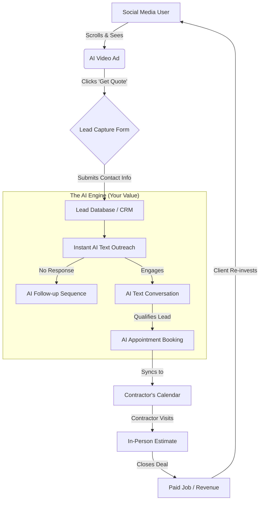

# AI Ad Agency Business Strategy (2026)

This document outlines the core pillars of building a high-ticket AI agency for local service-based businesses, focusing on creating predictable revenue through automated customer acquisition.

---

## 1. Pricing Structure: Retainer vs. Pay-Per-Lead (PPL)

To reach the target of **$2,000 – $5,000 per month** per client, you must choose a model that balances your risk with the client's budget.

| Model | How it Works | Best For |
| :--- | :--- | :--- |
| **Pure Retainer** | Flat **$2,500 - $5,000/mo**. Covers all management and tech. | High-budget clients who want guaranteed priority and "white glove" service. |
| **Pure Pay-Per-Lead** | **$50 - $100 per lead**. If you get them 40 leads, you bill $2,000 - $4,000. | Lower-trust clients who only want to pay for tangible results. High upside for you. |
| **The Hybrid (Rec.)** | **$1,500 base** (covers software/time) + **$25 - $40 per lead**. | Most clients. It covers your overhead while giving you "skin in the game" to scale. |

**The "Stickiness" Factor:** By controlling both the traffic (Ads) and the conversion (AI Bot), the client becomes dependent on your system. If they stop paying, their "Digital Sales Team" disappears.

---

## 2. Traffic Flow: The "Lead-to-Job" Engine

This diagram illustrates how a cold prospect is converted into a paid job through your AI-driven funnel.

---

## 3. Deep Dive into Services Offered

To justify high-ticket pricing, you provide a "Full-Stack Sales Engine" rather than just "Marketing."

### A. AI Video Creative Lab
You replace the need for expensive videographers by using AI tools (HeyGen, Sora, ElevenLabs) to create "scroll-stopping" local ads.
*   **Deliverable:** 2-4 new high-definition video ads per month.
*   **Value:** Prevents "ad fatigue" and ensures the brand stays fresh in the local community.

### B. Automated Lead Acquisition (The Ads)
Full management of Meta (Facebook/Instagram) or Google ad accounts.
*   **Deliverable:** Geo-fenced targeting, audience optimization, and daily budget management.
*   **Value:** Removes the technical burden and financial risk of the client "guessing" how to run ads.

### C. 24/7 Virtual Receptionist (AI Nurturing)
The "stickiest" part of the service. You provide an AI bot that responds to every lead within seconds.
*   **Deliverable:** Instant SMS/Email outreach, automated qualification, and direct calendar booking.
*   **Value:** Leads are 21x more likely to close if contacted within 5 minutes. The AI handles the "boring" texting that contractors hate.

### D. Database Reactivation
Instantly generate cash for new clients by tapping into their "dead" lead lists.
*   **Deliverable:** A massive "Reactivator" campaign texting old customers with a special offer.
*   **Value:** Often pays for your entire yearly retainer within the first 48 hours.

---

## 4. Sales & Positioning
**The Golden Rule:** Never sell the "Tech," always sell the "Outcome."

*   **Avoid Jargon:** Don't talk about "large language models." Talk about "booked jobs" and "cash flow."
*   **The "Word-of-Mouth" Gap:** Highlight that 90% of contractors rely solely on word-of-mouth, which is unpredictable.
*   **The Comparison:** Position your system as a "Digital Employee" that costs 70% less than a human but works 24/7 without complaining.

---

## 5. Outreach & Acquisition

*   **Inbound Ads:** Run your own AI-generated ads to attract business owners.
*   **Cold Outbound:** Targeted email or social media outreach using automated sequences.
*   **Note on Cold Calling:** High-effort, but highest conversion for local niches.

### Cold Calling Strategy: Targeted Recon

#### Who to Talk To (Decision Makers)
In local service-based businesses, you are looking for:
1.  **The Owner/Founder:** For companies with <15 employees. They make every financial decision.
2.  **The General Manager (GM) or Sales Director:** For larger outfits. They are responsible for the "bottom line" and hitting growth quotas.
*   **Avoid:** Technicians, office assistants, or site foremen. They cannot sign your contract.

#### How to Find Them (The Sleuth Approach)
Never call a business without a name. Use these steps to find the Decision Maker:
1.  **The "About Us" Page:** Check the company website. Most local shops list the owner's name and bio.
2.  **LinkedIn:** Search "[Company Name] Owner" or "Manager."
3.  **Secretary of State Website:** Search the business name in the state's business registry. Look for the "Registered Agent" or "Principals/Officers." This is public data and provides the legal owner's name.
4.  **Facebook "About" Section:** Many contractors are more active on Facebook than their own websites.
5.  **The "Gatekeeper" Call:** If all else fails, call the main line and say: *"Hey, I'm sending over some local market data for the owner, what was his name again? [Name]? Thanks."*

#### Cold Calling Pitch (The "Predictable Growth" Script)
> "Hi [Owner Name], I’m [Your Name]. I noticed your company has great reviews, but I’m calling because I’m working with a few [Roofers/Plumbers] in the area helping them move away from relying strictly on word-of-mouth. 
>
> Most of my clients were frustrated because they were paying for leads that never answered the phone. We’ve built an automated 'Lead-to-Sale' system that not only finds the leads but uses an AI assistant to text them and book the appointment directly onto your calendar. 
>
> It's essentially doing the work of two full-time sales reps for about a fraction of the cost. Do you have 5 minutes later this week to see the system we used to scale a local roofer from $40k to over $100k a month?"

---

## 6. Business Summary
**Business Name:** [Agency Name] AI Growth Partners  
**Target Niche:** Local Service-Based Businesses (Roofing, HVAC, Solar, Remodeling).  

**Value Proposition:**  
We provide an end-to-end customer acquisition engine for local contractors. We bridge the gap between a 'click' and a 'check' by using AI-generated high-performance video ads to find leads and proprietary AI nurturing bots to instantly text and book those leads into appointments.
